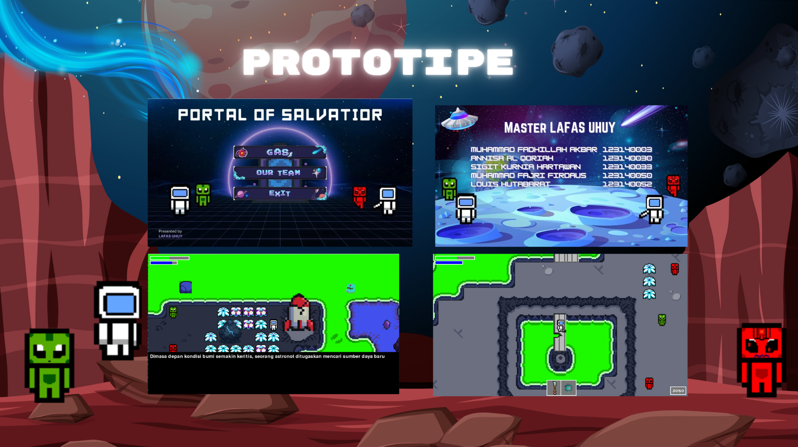
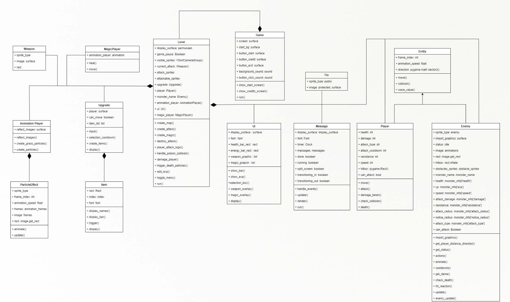

<h1 align="center">Portal Of Salvatior</h1>




# Table of Contents
[Team Name](#team-name) 

[Description](#description)

[Library](#library)

[How to Play](#howtoplay)

[UML Diagram](#UMLDiagram)

[Contributors](#contributors)

[Thanks To](#thanks-to)

## Team Name
**LAFAS UHUY**


## Description
**Portal Of Salvatior** adalah sebuah permainan petualangan berjenis top-down
adventure dengan elemen puzzle yang menjelajahi antariksa yang mengeksplorasi
luar angkasa dengan tujuan untuk menemukan sumber daya baru untuk
menyelamatkan umat manusia namun, astronot melakukan pendaratan darurat di
planet asing yang belum pernah dijelajahi. Disana dia harus melawan banyak alien
dan mempunyai misi untuk mengumpulkan 3 item batu agar dapat membuka portal
yang membawa dia ke jalan keluar dari planet berbahaya tersebut. Selama
mengeksplorasi, astronot harus berhati-hati karena di setiap langkah bisa bertemu
dengan alien. Pencarian portal menjadi tujuan utama astronot dengan mencari 3 item
batu merah, hijau, dan biru yang tersembunyi di dalam planet. Suasana petualangan
yang menegangkan dan penuh misteri menawarkan pengalaman petualangan yang
mendalam dan memikat bagi para pemainnya.
## Library
- [**pygame**](https://www.python.org/)
- [**random**](https://docs.python.org/3/library/random.html)
- [**math**](https://docs.python.org/3/library/math.html)
- [**eror**](https://chatgpt.com/)

## How to Play
<!--  -->

<li> Install Python 3.11 or higher</li>
Run the following command to start the game:

```
python3 main.py
```
alternative command:

```
python main.py
```
## UML Diagram



## Contributors

| Nama | NIM | Contributor |
| ---- | --- | --- |
| Muhammad Fadhilah Akbar | 123140003 |  |
| Annisa Al Qoriah | 123140030 |  |
| Sigit Kurnia Hartawan | 123140033 |  |
| Muhammad Fajri Firdaus | 123140050 |  |
| Louis Hutabarat | 123140052 |  | 

## Thanks To
- [Freepik](freepik.com )
- [Freesound](freesound.org)
- [Clear Code](https://www.youtube.com/@ClearCode)
- [Map Tiles](www.youtube.com/@gamefromscratch)
- [Coding With Rush](https://www.youtube.com/@CodingWithRuss)
- [fix eror](https://chatgpt.com/)


